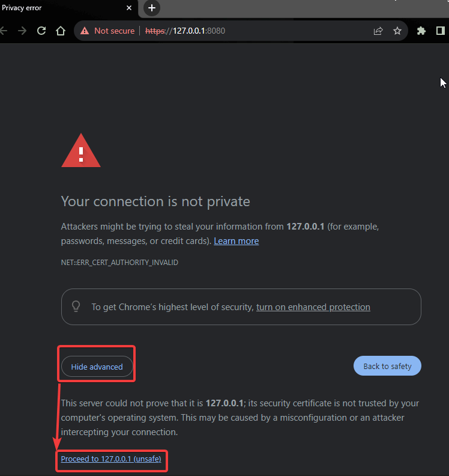
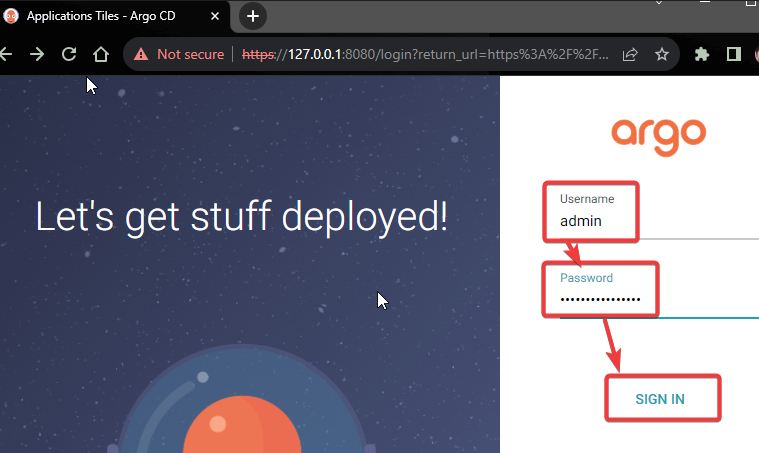
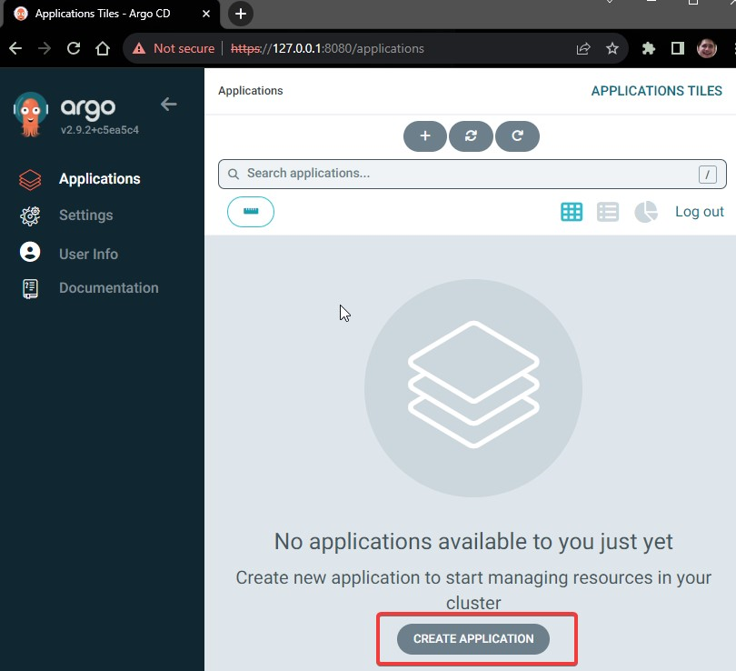
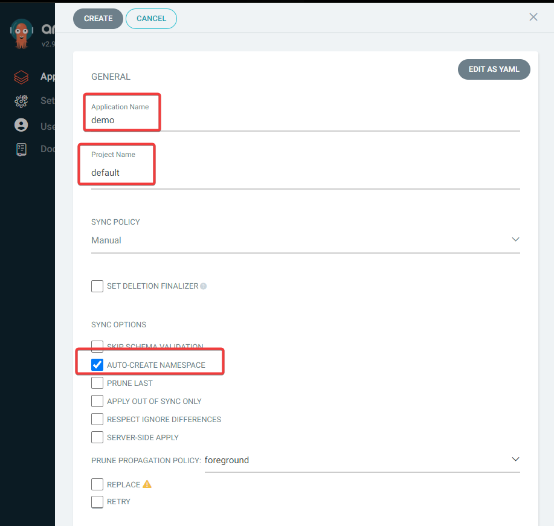
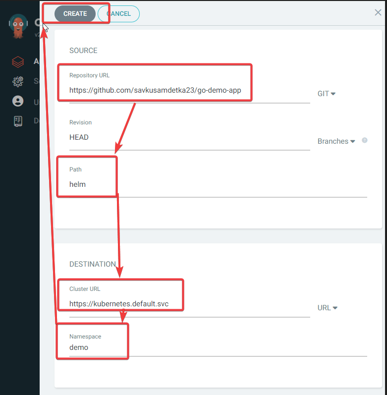
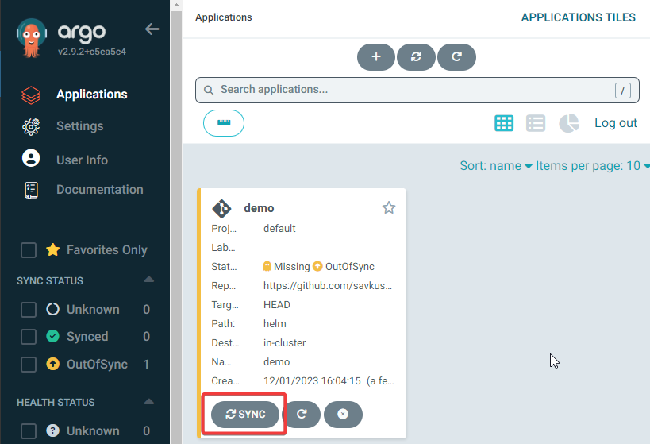
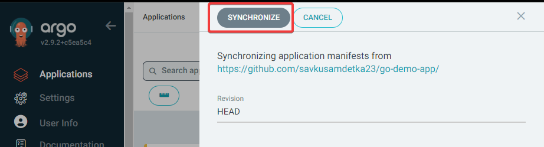
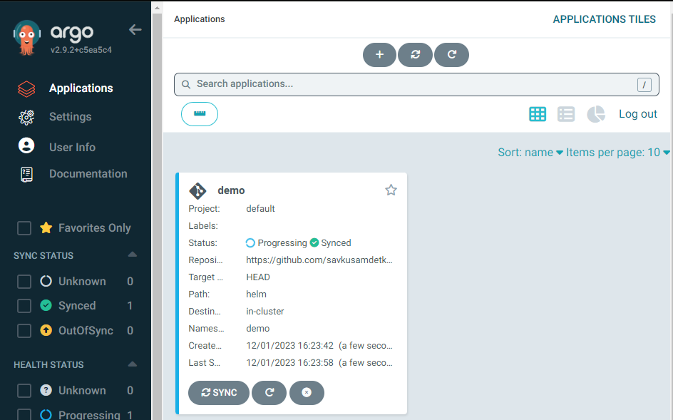
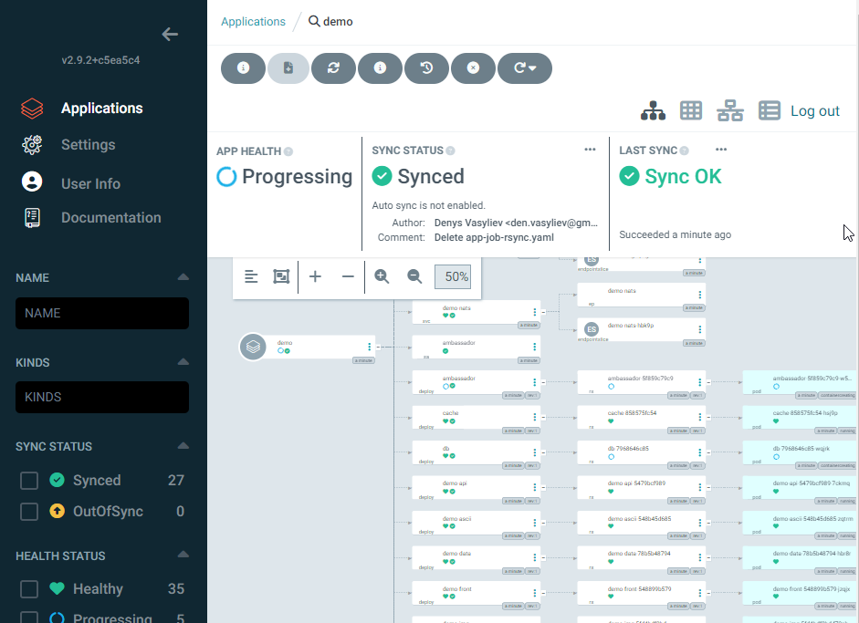

	k -n argocd get secret argocd-initial-admin-secret -o jsonpath="{.data.password}"|base64 -d;echo

## Open installed ArgoCD URL and configure application
Click to proceed to https://127.0.0.1:8080

Use the password from the last executed command to login as **admin**

On the home page click on **"Create applciation"**

 Provide **AppName**, set the **Project name** as default and enable option for **Namespace auto-creation**

  Scroll a bit down and:
  - set the project **URL from GitHub**
  - choose the path to the **helm** charts in the repo
  - select the **ClusterURL** from the dropdown list
  - set the **Namespace name**
  - click on the button **Create** on the top the page 

When the application is created, you can click on the **synchronization button** on the home page  

  You can click on the application itself to see more details about the application deployment
 

