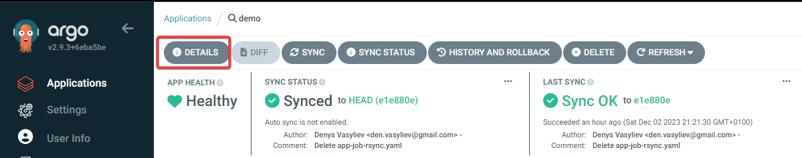

#	Minimum viable product (MVP) of the deployed application via ArgoCD
## Table of Contents:
- [Minimum viable product (MVP) of the deployed application via ArgoCD](#minimum-viable-product-mvp-of-the-deployed-application-via-argocd)
  - [Table of Contents:](#table-of-contents)
  - [Open installed ArgoCD URL](#open-installed-argocd-url)
  - [Configure application](#configure-application)
  - [Synchronize application](#synchronize-application)
  - [Enable auto synchronization:](#enable-auto-synchronization)
  - [Demo of the application running with ArgoCD](#demo-of-the-application-running-with-argocd)

## Open installed ArgoCD URL
After performing steps from POC document, click on the next URL to proceed to ArgoCD https://127.0.0.1:8080

Use the password from the last executed command from POC document to login as **admin**

## Configure application

On the home page click on **"Create applciation"**

 Provide **AppName**, set the **Project name** as default and enable option for **Namespace auto-creation**

  Scroll a bit down and:
  - set the project **URL from GitHub**: https://github.com/savkusamdetka23/go-demo-app.git
  - choose the path to the **helm** charts in the repo
  - select the **ClusterURL** from the dropdown list
  - set the **Namespace name**
  - click on the button **Create** on the top the page 

## Synchronize application

When the application is created, you can click on the **synchronization button** on the home page  

You can click on the application itself to see more details about the application deployment
 

## Enable auto synchronization:

Click on the applicaiton on the home page and then on the button **Details**:

Then click on **Edit**

Scroll down to the **SYNC POLICY** and click on the **"Enable auto-sync"**

After those actions the app will automatically trigger sycnhronization when any changes will be applied in GitHub repo.

## Demo of the application running with ArgoCD
- Execute next command to forward ports for the application:

      kubectl port-forward -n demo svc/ambassador 8082:80

- Open additional terminal window and download the image you would like to test with the next command to save some image locally (you can choose any other link for the image URL):

      wget -O /workspaces/AsciiArtify/k8s.png https://assets-global.website-files.com/63eab091d2e4cb36843a37be/654a6a7bee26c4d8b272459f_Just-in-time-access-Kubernetes-logo.png

  

- Use the saved image and then pass it as payload to the service:

      curl -F 'image=@k8s.png' localhost:8081/img/

