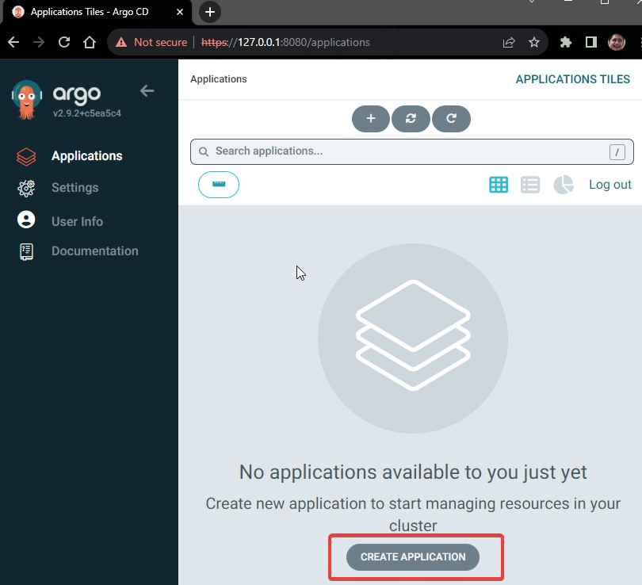
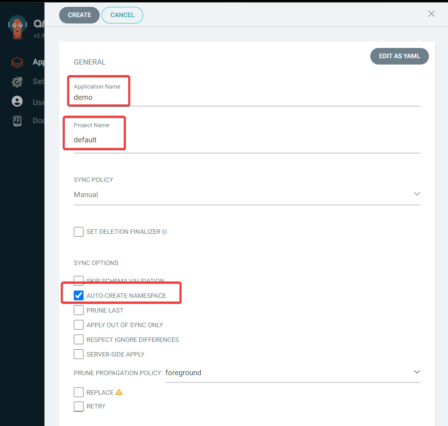
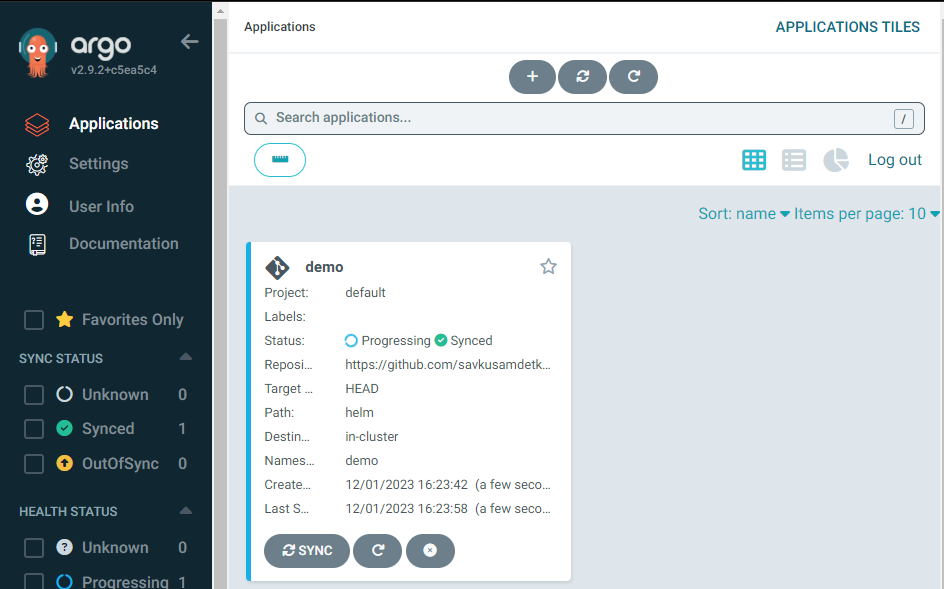
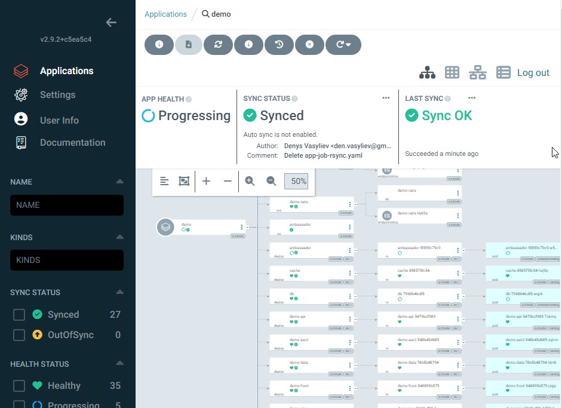

# Proof of Concept for ArgoCD creation and using for deployment automation.

## Install and configure ArgoCD
You can follow next animated .gif to perform installation of k3s cluster with ArgoCD:

    sudo apt-get update
    sudo apt-get install k3d
    alias k=kubectl
	k completion -h
    source <(kubectl completion bash)
    kubectl completion bash > ~/.kube/completion.bash.inc  
	printf "source '$HOME/.kube/completion.bash.inc'" >> $HOME/.bash_profile source $HOME/.bash_profile
	source <(kubectl completion bash)
	source <(kubectl completion bash|sed s/kubectl/k/g)

	k version
	k3d cluster create argo
	k cluster-info
	k version
	k get all -A

	kubectl create namespace argocd
	k get ns
	kubectl apply -n argocd -f https://raw.githubusercontent.com/argoproj/argo-cd/stable/manifests/install.yaml
	k get all -n argocd
	k get pod -n argocd -w
	kubectl port-forward svc/argocd-server -n argocd 8080:443&
	k -n argocd get secret argocd-initial-admin-secret -o jsonpath="{.data.password}"|base64 -d;echo

## Open installed ArgoCD URL and configure application
Click to proceed to https://127.0.0.1:8080

Use the password from the last executed command to login as **admin**

On the home page click on **"Create applciation"**

 Provide **AppName**, set the **Project name** as default and enable option for **Namespace auto-creation**

  Scroll a bit down and:
  - set the project **URL from GitHub**
  - choose the path to the **helm** charts in the repo
  - select the **ClusterURL** from the dropdown list
  - set the **Namespace name**
  - click on the button **Create** on the top the page 

When the application is created, you can click on the **synchronization button** on the home page  

  You can click on the application itself to see more details about the application deployment
 

