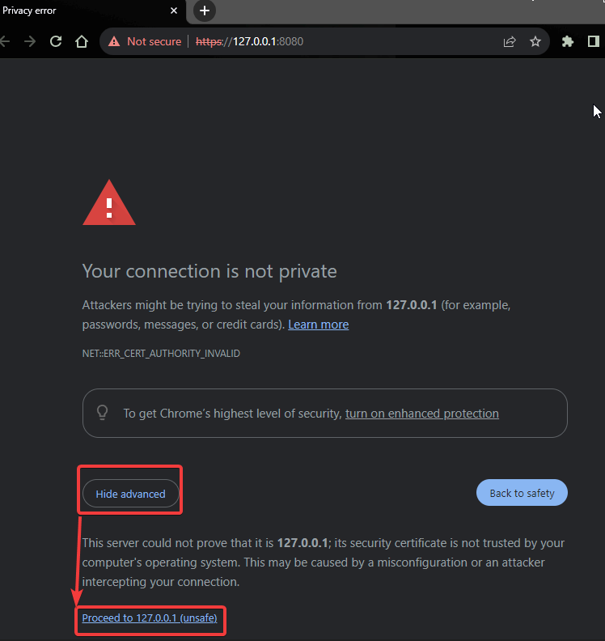

# Proof of Concept for ArgoCD creation and using for deployment automation.
## Table of Contents:
- [Proof of Concept for ArgoCD creation and using for deployment automation.](#proof-of-concept-for-argocd-creation-and-using-for-deployment-automation)
	- [Table of Contents:](#table-of-contents)
	- [Install and configure ArgoCD](#install-and-configure-argocd)
	- [Open installed ArgoCD URL and configure application](#open-installed-argocd-url-and-configure-application)
	- [Cleanup (optional)](#cleanup-optional)

## Install and configure ArgoCD
You can follow next animated .gif to perform installation of k3s cluster with ArgoCD:

Here are the commands that were used in the animated .gif:

	#install prerequisites
    sudo apt-get update
    sudo apt-get install k3d

	#configure alias for kubectl
    alias k=kubectl
	k completion -h
    source <(kubectl completion bash)
    kubectl completion bash > ~/.kube/completion.bash.inc  
	printf "source '$HOME/.kube/completion.bash.inc'" >> $HOME/.bash_profile source $HOME/.bash_profile
	source <(kubectl completion bash)
	source <(kubectl completion bash|sed s/kubectl/k/g)

	#perform checks
	k version
	k3d cluster create argo
	k cluster-info
	k version
	k get all -A

	# create and configure namespace
	k create namespace argocd
	k get ns
	k apply -n argocd -f https://raw.githubusercontent.com/argoproj/argo-cd/stable/manifests/install.yaml
	k get all -n argocd
	k get pod -n argocd -w
	k port-forward svc/argocd-server -n argocd 8080:443&
	#get password for admin user
	k -n argocd get secret argocd-initial-admin-secret -o jsonpath="{.data.password}"|base64 -d;echo

After exeution of the last commandm you need to copy and securely save the password for the ArgoCD admin account.

## Open installed ArgoCD URL and configure application
Click to proceed to https://127.0.0.1:8080

Use the password from the last executed command to login as **admin**

## Cleanup (optional)
To cleanup environment, use next command:

	k3d cluster delete argo
